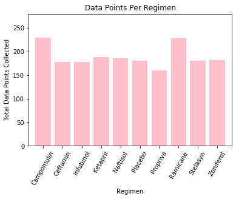
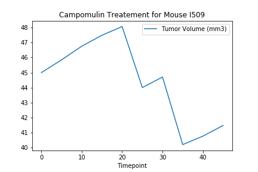

# Matplotlib Challenge: Cancer Drug Analysis

## Summary: 

This project focused on basic pandas and Matplotlib concepts using Jupyter Notebook. I analyzed practice research data from a mouse cancer study. The final results were displayed with statistical tables and graphs. 

* [Jupyter Notebook](https://nbviewer.jupyter.org/github/kasiakalemba/Matplotlib-Cancer-Study/blob/master/Pymaceuticals.ipynb#/) 

## Skills Displayed: 
* Reading data from external files 
* Navigation, exploration and cleaning of dataframes 
* Generation of plots using Matplotlib in Jupyter Notebook
* Basic statistics and calculations using pandas 

## The Power of Plots 
In this study, 250 mice identified with SCC tumor growth were treated through a variety of drug regimens. Over the course of 45 days, tumor development was observed and measured. The purpose of this study was to compare the performance of Pymaceuticals' drug of interest, Capomulin, versus the other treatment regimens. We were tasked to generate all of the tables and figures needed for the technical report of the study. 

The final report includes the following: 
* A summary statistics table consisting of the mean, median, variance, standard deviation, and SEM of the tumor volume for each drug regimen. Based on this data we can see that two drugs seem promising for inhibition of tumor growth: Ramicane and Capomulin as they show the lowest mean tumor volume at the end of treatment. 

* A bar plot that shows the number of data points for each treatment regimen to compare the n values for each group. The promising drugs mentioned above seem like they have more data points collected which could potentially conflict with the first observation of them being the most promising. In order to be more accurate, an equal number of datapoints should be seen across all drugs tested. 

* A box and whisker plot of the final tumor volume for all four treatment regimens and highlight any potential outliers. This plot diplays 4 selected drugs from the summary statistic table. Here we can see that Campomulin and Ramicane have smaller final tumor weights compared to the other two displayed. 

* A line plot of time point versus tumor volume for mouse number l509 treated with Capomulin which was a sample plot of a test subject to see how Capomulin decreases tumor volume over time. 

* The correlation coefficient and linear regression model between mouse weight and average tumor volume for the Capomulin treatment. It shows a positive correlation between the mice's increasing weight and their corresponding tumor size. 

