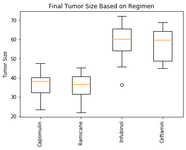

# Matplotlib Challenge - Basic Skills Demonstration

## Summary: 
This challenge focused on basic pandas and Matplotlib concepts using Jupyter Notebook. Our task The was to analyze research data from a mouse cancer study. The final results were statistical tables and graphs. 

* [Jupyter Notebook](https://nbviewer.jupyter.org/github/kasiakalemba/Matplotlib-Cancer-Study/blob/master/Pymaceuticals.ipynb#/) 

## Skills Displayed: 
* Reading data from large external files 
* Navigation and exploration of large dataframes 
* Generation of plots using Matplotlib in Jupyter Notebook
* Basic statistics and calculations using pandas 

## The Power of Plots 
In this study, 250 mice identified with SCC tumor growth were treated through a variety of drug regimens. Over the course of 45 days, tumor development was observed and measured. The purpose of this study was to compare the performance of Pymaceuticals' drug of interest, Capomulin, versus the other treatment regimens. We were tasked to generate all of the tables and figures needed for the technical report of the study. 

The final report includes the following: 
* Combination of two datasets into a single dataframe 

* A summary statistics table consisting of the mean, median, variance, standard deviation, and SEM of the tumor volume for each drug regimen.

* A bar plot using both Pandas's DataFrame.plot() and Matplotlib's pyplot that shows the number of data points for each treatment regimen.

* A box and whisker plot of the final tumor volume for all four treatment regimens and highlight any potential outliers in the plot by changing their color and style.

* A line plot of time point versus tumor volume for mouse number l509 treated with Capomulin.

* The correlation coefficient and linear regression model between mouse weight and average tumor volume for the Capomulin treatment.

